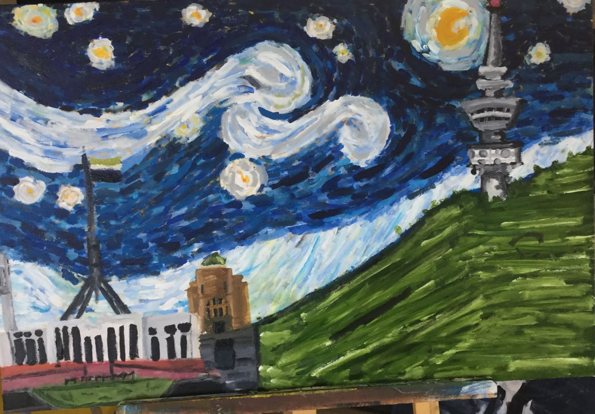

---
# set the layout to use, in this case, the homepage one
layout: layouts/homepage

# set the page title
title: Artist Sethie

# We can set extra info here to use in our templates 
# 

images:
    first: assets/images/image1.jpg
    second: assets/images/image2.jpg
    third: assets/images/image3.jpg
    forth: assets/images/image6.jpg
    five: assets/images/image5.png
    six: assets/images/image4.jpg
    seven: assets/images/Backcan.JPG

---
# About the Artist
I'm a Canberra born Artist and have studied Visual Art through high school every year (year 7 - 12) and currently studying a Bachlour of Art in Digital Media. I have worked in many medium throughout my life, some areas I have worked with in tradition art is Sketching, painting, scupture, etc. In other areas I have done digital art, animation software and film editing (primere pro, after effect, and Davinci Resolve). I dream to become a animator and create great animated film for people to see. [Read More...](#about)
